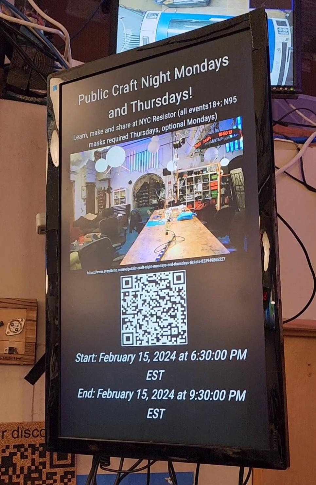

# MMM-Eventbrite

The MMM-Eventbrite module displays upcoming events from Eventbrite on your Magic Mirror. This module allows you to specify an organizer and display their public events, keeping you informed about upcoming events without leaving your mirror. Additionally, it provides the flexibility to exclude specific events from being displayed based on their names using regular expressions.

## Screenshot



## Installation

1. Navigate to your Magic Mirror's modules directory:

```sh
cd ~/MagicMirror/modules
```

2. Clone the MMM-Eventbrite repository:

```sh
git clone https://github.com/yourusername/MMM-Eventbrite.git
```

3. Change into the newly cloned module's directory:

```sh
cd MMM-Eventbrite
```

4. Install the module's dependencies:

```sh
npm install
```

## Configuration

To use the MMM-Eventbrite module, you need to add it to the `config/config.js` file in your Magic Mirror's directory. Here is an example configuration:

```js
{
    module: "MMM-Eventbrite",
    position: "middle_center",
    config: {
        apiKey: "YOUR_EVENTBRITE_API_KEY",
        organizerId: "YOUR_ORGANIZER_ID",
        timeZone: "America/New_York", // Optional, defaults to "America/New_York"
        doNotShow: ["^Public Craft Night"]
    }
}
```

### Configuration Options

| Option        | Description                                                                                       |
|---------------|---------------------------------------------------------------------------------------------------|
| `apiKey`      | **Required** Your Eventbrite API key.                                                             |
| `organizerId` | **Required** The Eventbrite organizer ID.                                                         |
| `timeZone`    | **Optional** The time zone used for displaying event times. Defaults to "America/New_York".       |
| `doNotShow`   | **Optional** An array of regular expressions for event names that you wish to exclude from being displayed.    |

## Dependencies

* An internet connection to fetch events from Eventbrite.
* The `npm` packages installed via `npm install` within the module directory.

## Notes

- Make sure to replace `"YOUR_EVENTBRITE_API_KEY"` and `"YOUR_ORGANIZER_ID"` with your actual Eventbrite API key and organizer ID.
- The `timeZone` option allows you to customize the time zone for event times. It is optional and will default to "America/New_York" if not specified.
- The `doNotShow` field allows you to specify patterns for event names that should not be displayed. For example, `["^Public Craft Night"]` excludes events starting with "Public Craft Night".
- Regular expressions in the `doNotShow` array must be properly escaped if they contain characters that have special meanings in regex syntax.

## Updating

To update the module to the latest version, pull the changes from this repository and reinstall the dependencies:

```sh
cd ~/MagicMirror/modules/MMM-Eventbrite
git pull
npm install
```
